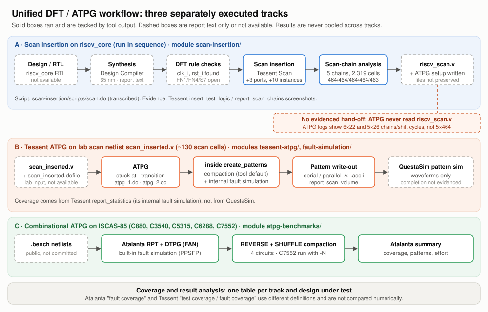
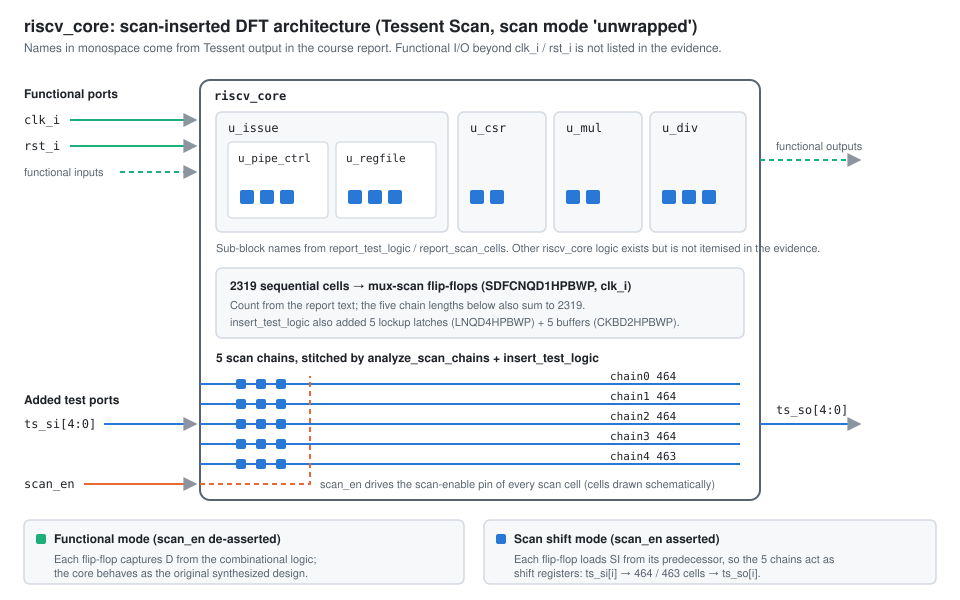
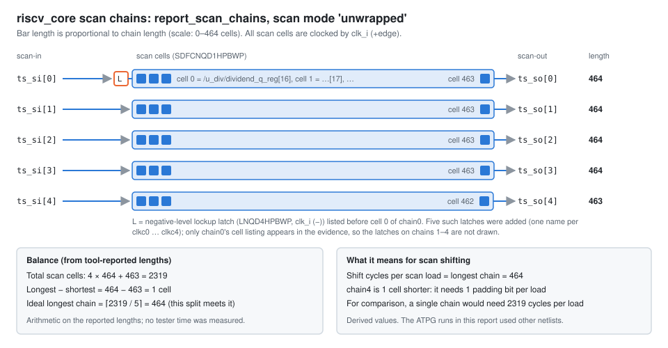
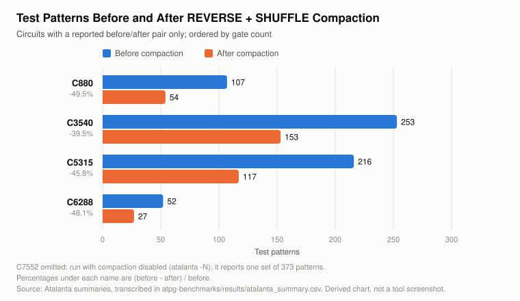

# VLSI Design for Testability: Scan Insertion and ATPG

This repository brings together scan insertion, structural fault testing, ATPG, test-pattern compaction and fault/pattern simulation from one VLSI testing project, organised as four modules with traceable evidence:

- **Scan insertion** on a RISC-V core (`riscv_core`, 2,319 flip-flops, TSMC 65 nm) with Siemens Tessent Scan: DFT rule checks, scan-cell replacement, stitching into five balanced chains.
- **Tessent ATPG**: stuck-at and broadside transition patterns, coverage and scan volume, run on a lab scan netlist.
- **Benchmark ATPG**: Atalanta on five ISCAS-85 circuits, with redundant-fault analysis and REVERSE + SHUFFLE compaction.
- **Fault and pattern simulation**: tool-internal fault simulation and QuestaSim simulation of the generated pattern testbenches.

The RISC-V-specific work is the scan insertion. The ATPG evidence shows it ran on a different, smaller netlist, so **no ATPG coverage is claimed for the RISC-V core** ([why](docs/riscv-dft.md)).

> **Evidence base.** Everything here was reconstructed from a course report (*BEVD309L Testing of VLSI Circuits*, VIT, Fall 2025-26). Scripts are transcribed from screenshots, and results come from tool-output screenshots kept in each module's `results/screenshots/`. Netlists, raw logs and pattern files were not preserved. Every number below names its source; disagreements between the report's prose and its tool output are listed in [docs/evidence-audit.md](docs/evidence-audit.md).

---

## 1. Project overview

| Module | What was done | Design under test | Tools | Evidence |
|---|---|---|---|---|
| [`scan-insertion/`](scan-insertion/) | DFT rule checks, scan insertion, chain stitching and balancing | `riscv_core` gate-level netlist, 2,319 flip-flops | Design Compiler (synthesis, report only), Tessent Scan | Tessent screenshots, `scan.do` |
| [`tessent-atpg/`](tessent-atpg/) | Stuck-at and transition ATPG, coverage, scan volume | Lab scan netlist `scan_inserted.v` (~130 scan cells) | Tessent ATPG | Tessent screenshots, `atpg_1.do`, `atpg_2.do` |
| [`fault-simulation/`](fault-simulation/) | Gate-level simulation of the ATPG pattern testbenches | Same lab netlist | QuestaSim | Two waveform screenshots |
| [`atpg-benchmarks/`](atpg-benchmarks/) | Stuck-at ATPG, coverage, redundancy, compaction, effort analysis | ISCAS-85 C880, C3540, C5315, C6288, C7552 | Atalanta | Five summary screenshots, CSV, Python analysis |

The four modules come from three earlier repositories, consolidated here ([provenance](docs/repository-guide.md)).

## 2. DFT objectives

1. **Make a synthesised processor core structurally testable.** Give every flip-flop direct controllability and observability through scan chains, and confirm that the netlist meets DFT rules.
2. **Keep test cost low.** Balance the chains so that shift time is minimal for the chosen chain count.
3. **Generate and grade tests** for static (stuck-at) and dynamic (transition) faults, and read coverage correctly: test coverage, fault coverage and ATPG effectiveness are three different metrics.
4. **Understand ATPG behaviour.** Measure how redundancy, search limits, compaction and circuit structure shape coverage and pattern count on standard benchmarks.
5. **Validate patterns** by independent simulation.

## 3. Unified DFT workflow



The textbook order is shown below. Brackets mark which track each stage belongs to. **A**, **B** and **C** were executed separately on different designs; only the stages within track A ran in sequence on one design.

```text
Design / RTL                    riscv_core; RTL not available                                    [A]
     ↓
DFT Rule Checks                 Tessent: clk_i, rst_i; FN1/FN4/S7 warnings (report text)         [A]
     ↓
Scan Insertion                  Tessent Scan: mux-scan cells, +3 ports, +10 instances            [A]
     ↓
Scan-Chain Analysis             5 chains: 464/464/464/464/463                                    [A]
     ┆  ✗ no evidenced hand-off: riscv_scan.v was written but no ATPG run read it
ATPG                            Tessent on lab netlist scan_inserted.v                           [B]
                                Atalanta on ISCAS-85 (separate experiment)                       [C]
     ↓
Pattern Compaction              Tessent: implicit in create_patterns (no before/after counts)    [B]
                                Atalanta: REVERSE + SHUFFLE (before/after reported)              [C]
     ↓
Fault Simulation                Tessent and Atalanta internal fault simulation (source of coverage)  [B][C]
                                QuestaSim pattern simulation (waveforms; completion not evidenced)   [B]
     ↓
Coverage and Result Analysis    one table per track and design; never pooled
```

Detail: [docs/architecture.md](docs/architecture.md).

## 4. Scan insertion and chain balancing

`riscv_core` was taken through one Tessent Scan dofile, [`scan-insertion/scripts/scan.do`](scan-insertion/scripts/scan.do):

```tcl
set_context dft -scan
read_verilog netlist_riscvcore.v
read_cell_library tcbn65gplushpbwp.mdt
set_current_design
analyze_control_signals -auto_fix
check_design_rules
report_drc_rules
report_scan_elements
add_scan_mode unwrapped -chain_count 5
analyze_scan_chains
insert_test_logic
report_test_logic
report_scan_chains
report_scan_cells
write_design -output_file riscv_scan.v -replace
write_atpg_setup scan -replace
```



- **DFT rule checks.** One clock (`/clk_i`) and one reset (`/rst_i`) were identified. The report records FN1 (floating nets), FN4 (non-controllable flip-flops) and S7 (constant-driven cells) as warnings that did not stop insertion. No DRC output survives, so counts are unknown and **the design is not described as DFT-clean**.
- **Insertion and stitching.** Flip-flops became `SDFCNQD1HPBWP` mux-scan cells (visible rows). Tessent added `ts_si[4:0]`, `ts_so[4:0]` and `scan_en`, plus 5 lockup latches and 5 buffers.
- **Balancing.** The chains are 464/464/464/464/463. Since 2,319 = 5 × 463 + 4, this 1-cell spread is the best possible split. Each load takes 464 shift cycles instead of 2,319 for one chain (calculated, not measured).



Module: [`scan-insertion/`](scan-insertion/) · detail: [docs/scan-insertion.md](docs/scan-insertion.md).

## 5. ATPG benchmark experiments

Atalanta (`RPT + DTPG + TC`: random patterns, FAN deterministic search with backtrack limit 10, REVERSE + SHUFFLE compaction) on five ISCAS-85 circuits, single stuck-at faults:


- Coverage 96.004–100 %. In four circuits every undetected fault was **proven redundant**. Only C7552 left faults aborted (61).
- Gate count tracks fault-list size (ρ = 0.90) but not pattern count, effort or coverage. C6288, the deepest circuit, needed the fewest patterns.

Module: [`atpg-benchmarks/`](atpg-benchmarks/) · detail: [docs/benchmark-results.md](docs/benchmark-results.md) · method: [docs/atpg-methodology.md](docs/atpg-methodology.md).

**Tessent ATPG** on the lab scan netlist covered stuck-at faults and broadside (launch-off-capture, sequential depth 2) transition faults, with held primary inputs and masked outputs. Module: [`tessent-atpg/`](tessent-atpg/) · detail: [docs/tessent-atpg.md](docs/tessent-atpg.md).

## 6. RISC-V DFT module

| Activity | On `riscv_core`? |
|---|---|
| Synthesis (Design Compiler, TSMC 65 nm) | Yes, report text only |
| DFT rule checks, scan insertion, chain stitching and balancing | **Yes**, with tool output |
| Stuck-at / transition ATPG | **No evidence.** ATPG read `scan_inserted.v` (6×22 and 5×26 chains/shift cycles, ~1,150 gates), not `riscv_scan.v` (5×464) |
| QuestaSim pattern simulation | **No evidence.** It simulated the lab-netlist patterns |

Visible hierarchy: `u_mul`, `u_div`, `u_csr`, `u_issue/u_pipe_ctrl`, `u_issue/u_regfile`. The RTL, the ISA subset and the core's origin are not available. The RISC-V scan-insertion files live in [`scan-insertion/`](scan-insertion/). No separate `riscv-dft/` folder exists because there is no RTL and no other RISC-V-specific file. Detail: [docs/riscv-dft.md](docs/riscv-dft.md).

## 7. Fault simulation

| Simulator | Role | Coverage? |
|---|---|---|
| Atalanta built-in (PPSFP) | Drops detected faults during RPT, DTPG and compaction | Yes (Atalanta FC) |
| Tessent internal | Drops detected faults inside `create_patterns` | Yes (Tessent TC/FC/AE) |
| QuestaSim | Simulates Tessent's serial/parallel Verilog testbenches against the fault-free netlist | **No**; validates patterns only |
| Fsim | Listed in the procedure | No output recorded |

The QuestaSim runs produced waveforms. The report calls the step both "50 % / partial" and "completed successfully", and no mismatch count exists, so **completion is not evidenced**. Module: [`fault-simulation/`](fault-simulation/) · detail: [docs/fault-simulation.md](docs/fault-simulation.md).

## 8. Test-pattern compaction



| Circuit | Before | After | Reduction |
|---|---:|---:|---:|
| C880 | 107 | 54 | 49.5 % |
| C3540 | 253 | 153 | 39.5 % |
| C5315 | 216 | 117 | 45.8 % |
| C6288 | 52 | 27 | 48.1 % |
| C7552 | 373 (run with `-N`) | — | — |

REVERSE + SHUFFLE drops a pattern only if it detects nothing new, so the detected-fault set is preserved by construction. In Tessent, compaction is internal to `create_patterns` and no before/after counts are reported, so no ratio is claimed. For the scan designs, test data volume (loads × chains × shift cycles) is reported instead. Detail: [docs/test-pattern-compaction.md](docs/test-pattern-compaction.md).

## 9. Results and comparisons

One table per experiment. Tags: **Tool** = tool-output screenshot · **Text** = report prose only · **Derived** = arithmetic on Tool values.

### 9.1 Scan insertion: `riscv_core`

| DUT | Metric | Value | Tag | Supporting file |
|---|---|---:|---|---|
| riscv_core | Scan chains | 5 | Tool | [`report_scan_chains.txt`](scan-insertion/results/report_scan_chains.txt) |
| riscv_core | Chain lengths | 464 / 464 / 464 / 464 / 463 | Tool | [`report_scan_chains.txt`](scan-insertion/results/report_scan_chains.txt) |
| riscv_core | Scan cells in chains | 2,319 | Derived | [`check_chain_balance.py`](scan-insertion/scripts/check_chain_balance.py) |
| riscv_core | Chain spread / shift cycles per load | 1 / 464 | Derived | [`check_chain_balance.py`](scan-insertion/scripts/check_chain_balance.py) |
| riscv_core | Added ports / instances / retiming latches | 3 / 10 / 5 | Tool | [`insert_test_logic_summary.txt`](scan-insertion/results/insert_test_logic_summary.txt) |
| riscv_core | Flip-flops; "100 % scan insertion" | 2,319; consistent with chain total | Text | report pp. 12–13 |
| riscv_core | Gates | 34,714 | Text | report p. 12 |
| riscv_core | DRC warnings | FN1, FN4, S7 (open) | Text | report pp. 11–12 |

### 9.2 Tessent ATPG: lab netlist `scan_inserted.v` (not riscv_core)

| DUT | Fault model | Metric | Value | Tag | Supporting file |
|---|---|---|---:|---|---|
| scan_inserted.v | Stuck-at | Fault universe | 3,300 | Tool | [`stuck_at_atpg_excerpt.txt`](tessent-atpg/results/stuck_at_atpg_excerpt.txt) |
| scan_inserted.v | Stuck-at | Test / fault coverage | 100.00 % / 97.82 % | Tool | same |
| scan_inserted.v | Stuck-at | ATPG effectiveness | 100.00 % | Tool | same |
| scan_inserted.v | Stuck-at | Test patterns (simulated) | 69 (85) | Tool | same |
| scan_inserted.v | Stuck-at | Chains × shift cycles; volume | 6 × 22; 9,240 | Tool | same |
| LAB4/scan_inserted.v | Transition (broadside) | Fault universe | 2,690 | Tool | [`transition_atpg_excerpt.txt`](tessent-atpg/results/transition_atpg_excerpt.txt) |
| LAB4/scan_inserted.v | Transition | Test / fault coverage | 85.95 % / 85.95 % | Tool | same |
| LAB4/scan_inserted.v | Transition | ATPG effectiveness | 99.89 % | Tool | same |
| LAB4/scan_inserted.v | Transition | ATPG-untestable (AU) | 375 (13.94 %) | Tool | same |
| LAB4/scan_inserted.v | Transition | Test patterns (simulated) | 86 = 3 + 83 clock-seq. (103) | Tool | same |
| LAB4/scan_inserted.v | Transition | Chains × shift cycles; volume | 5 × 26; 11,310 | Tool | same |

### 9.3 Benchmark ATPG: ISCAS-85, Atalanta, single stuck-at

| DUT | Fault coverage | Collapsed faults | Redundant | Aborted | Patterns (after) | Tag | Supporting file |
|---|---:|---:|---:|---:|---:|---|---|
| C880 | 100.000 % | 942 | 0 | 0 | 54 | Tool | [`c880_atalanta_summary.png`](atpg-benchmarks/results/screenshots/c880_atalanta_summary.png) |
| C3540 | 96.004 % | 3,428 | 137 | 0 | 153 | Tool | [`c3540_atalanta_summary.png`](atpg-benchmarks/results/screenshots/c3540_atalanta_summary.png) |
| C5315 | 98.897 % | 5,350 | 59 | 0 | 117 | Tool | [`c5315_atalanta_summary.png`](atpg-benchmarks/results/screenshots/c5315_atalanta_summary.png) |
| C6288 | 99.561 % | 7,744 | 34 | 0 | 27 | Tool | [`c6288_atalanta_summary.png`](atpg-benchmarks/results/screenshots/c6288_atalanta_summary.png) |
| C7552 | 98.252 % | 7,550 | 71 | 61 | 373 (uncompacted) | Tool | [`c7552_atalanta_summary.png`](atpg-benchmarks/results/screenshots/c7552_atalanta_summary.png) |

All values: [`atalanta_summary.csv`](atpg-benchmarks/results/atalanta_summary.csv).

### 9.4 Fault and pattern simulation

| DUT | Simulator | Metric | Value | Tag | Supporting file |
|---|---|---|---|---|---|
| ISCAS-85 (5) | Atalanta built-in | Fault-simulation CPU time | 0.000–0.567 s per circuit | Tool | [`atalanta_summary.csv`](atpg-benchmarks/results/atalanta_summary.csv) |
| scan_inserted.v | Tessent internal | Faults simulated (stuck-at / transition) | 2,273 / 1,910; 0 / 3 left at end | Tool | [`tessent-atpg/results/`](tessent-atpg/results/) |
| scan_inserted.v | QuestaSim | Waveforms for both pattern sets | produced | Tool | [`fault-simulation/results/screenshots/`](fault-simulation/results/screenshots/) |
| scan_inserted.v | QuestaSim | Completion / mismatches | **unknown** | — | — |

### What may and may not be compared

- Within a table: yes.
- **Across tables: no.** The designs differ, and "fault coverage" means different things in Atalanta (redundant faults counted against it) and Tessent (separate TC/FC/AE). A 100 % in one table and a 100 % in another are not the same achievement.

### Implemented, simulated, reported, proposed

| Status | Items |
|---|---|
| **Implemented and evidenced by tool output** | `riscv_core` scan insertion and chains; Tessent stuck-at and transition ATPG on the lab netlist; Atalanta ATPG and compaction on five ISCAS-85 circuits |
| **Simulated, completion not evidenced** | QuestaSim pattern simulation |
| **Reported in text only** | Synthesis, gate count, DRC findings, clock checks, "100 % scan insertion" |
| **Recomputed here** | Chain statistics, Atalanta derived metrics, all Tessent coverage arithmetic |
| **Proposed, not done** | Everything under [Future work](#13-future-work) |

## 10. Tools and implementation

| Tool | Purpose | In this repository |
|---|---|---|
| Synopsys Design Compiler | RTL → TSMC 65 nm netlist | Not included (licensed); `syn.tcl` not available |
| Siemens Tessent Shell, `dft -scan` | DRC, scan insertion, chain reports | Not included (licensed); dofile transcribed |
| Siemens Tessent Shell, `patterns -scan` | Stuck-at and transition ATPG | Not included (licensed); dofiles transcribed |
| Siemens QuestaSim | Pattern testbench simulation | Not included (licensed); no scripts survive |
| Atalanta, Fsim (Virginia Tech) | Combinational stuck-at ATPG, fault simulation | Not included; public academic tools |
| Python 3 (standard library) | Chain statistics, Atalanta metric derivation, SVG charts | [`scan-insertion/scripts/`](scan-insertion/scripts/), [`atpg-benchmarks/scripts/`](atpg-benchmarks/scripts/) |

Technology: TSMC 65 nm (`tcbn65gplus`, HPBWP; Tessent library `tcbn65gplushpbwp.mdt`). No library content is included. Tool versions were not recorded in any surviving evidence.

[`requirements.txt`](requirements.txt) is intentionally empty: no third-party Python packages are used. The `.gitattributes` file marks Tessent `*.do` dofiles as Tcl so that GitHub does not report them as Stata.

## 11. Reproduction instructions

| What | Possible here? | Command |
|---|---|---|
| Chain statistics | Yes | `python3 scan-insertion/scripts/check_chain_balance.py` |
| Atalanta derived metrics and charts | Yes | `python3 atpg-benchmarks/scripts/derive_metrics.py && python3 atpg-benchmarks/scripts/make_charts.py && python3 atpg-benchmarks/scripts/make_diagrams.py` |
| Atalanta ATPG | With Atalanta and the public `.bench` files | `atalanta -t c880.test iscas85/c880.bench` (see [atalanta-commands.md](atpg-benchmarks/atalanta-commands.md)) |
| Tessent scan insertion | With licences, the TSMC library and `netlist_riscvcore.v` (not preserved) | `scan-insertion/scripts/scan.do` |
| Tessent ATPG | With licences, the library and `scan_inserted.v` + dofile (not preserved) | `tessent-atpg/scripts/atpg_1.do`, `atpg_2.do` |
| QuestaSim | With licences, cell models and the pattern files (not preserved) | No recorded script |

The four Python scripts were run for this consolidation on Python 3.11, 3.12 and 3.13. They reproduce every committed CSV and chart byte-for-byte. **No EDA flow and no Atalanta run was re-executed.** Full guide: [docs/reproduction.md](docs/reproduction.md).

## 12. Limitations

- **No ATPG on the RISC-V core.** Coverage of the 2,319-cell `riscv_core` scan netlist is unknown.
- **Screenshot-level evidence only.** No RTL, `syn.tcl`, netlists, raw logs, pattern files or QuestaSim transcripts. Scripts are transcriptions.
- **DRC warnings FN1, FN4 and S7 are open**, with unknown counts. Gate count and "100 % scan insertion" are text-only.
- **No area, timing or power** comparison for scan insertion, and no functional equivalence check.
- **QuestaSim completion is unknown**; no simulator produced an independent coverage figure.
- **Transition test coverage of 85.95 %** on the lab netlist is well below typical production targets; 370 AU faults are unclassified.
- **Benchmarks:** five small combinational circuits, one run and one seed each. C7552 was not compacted. N-detect, user fault lists, Fsim and X/0/1-fill items have no results.
- **Fault models:** stuck-at and transition only. No path-delay, bridging, IDDQ or cell-aware faults; no compression; no BIST.

## 13. Future work

Proposed only. None of this has been done.

- Run stuck-at and transition ATPG on `riscv_scan.v` with its own `write_atpg_setup` output, and report `riscv_core` coverage.
- Archive `report_drc_rules` and resolve FN1/FN4/S7; run a formal equivalence check before and after scan.
- Add EDT compression and compare scan volume against the 464-cycle-per-load baseline.
- Investigate the 370 unclassified AU transition faults (launch-off-shift, relaxed output masking).
- Keep QuestaSim transcripts with mismatch counts; cross-check Atalanta coverage with Fsim.
- Re-run the benchmarks over several seeds, run C7552 with compaction and higher backtrack limits, and complete the X/0/1-fill comparison.
- Script an end-to-end regression that parses tool logs instead of screenshots.

## 14. Module and file index

```text
vlsi-testing-atpg/
├── README.md                 this page
├── LICENSE                   MIT (repository's own text, data and scripts)
├── .gitignore  .gitattributes  requirements.txt
├── scan-insertion/           riscv_core scan insertion (Tessent Scan)
│   ├── README.md
│   ├── scripts/              scan.do, check_chain_balance.py
│   └── results/              transcribed Tessent reports; screenshots/
├── tessent-atpg/             stuck-at + transition ATPG on lab netlist scan_inserted.v
│   ├── README.md
│   ├── scripts/              atpg_1.do, atpg_2.do
│   └── results/              transcribed ATPG logs; screenshots/
├── fault-simulation/         QuestaSim pattern-simulation evidence
│   ├── README.md
│   └── results/screenshots/
├── atpg-benchmarks/          ISCAS-85 ATPG with Atalanta
│   ├── README.md  atalanta-commands.md
│   ├── benchmarks/           how to obtain the .bench netlists
│   ├── scripts/              derive_metrics.py, make_charts.py, make_diagrams.py
│   └── results/              atalanta_summary.csv, derived CSVs; screenshots/
├── docs/                     cross-cutting documentation (below)
└── assets/                   SVG diagrams and charts
```

| Document | Content |
|---|---|
| [docs/architecture.md](docs/architecture.md) | Three tracks, annotated flow, module layout, tool map |
| [docs/scan-insertion.md](docs/scan-insertion.md) | Synthesis, DRC, insertion, stitching, chains, balance, shift/capture |
| [docs/riscv-dft.md](docs/riscv-dft.md) | What is and is not RISC-V work |
| [docs/atpg-methodology.md](docs/atpg-methodology.md) | Fault models, Atalanta and Tessent ATPG, coverage definitions |
| [docs/tessent-atpg.md](docs/tessent-atpg.md) | Tessent stuck-at and transition results |
| [docs/benchmark-results.md](docs/benchmark-results.md) | ISCAS-85 results and analysis |
| [docs/test-pattern-compaction.md](docs/test-pattern-compaction.md) | Compaction and test data volume |
| [docs/fault-simulation.md](docs/fault-simulation.md) | Atalanta, Tessent and QuestaSim simulation |
| [docs/evidence-audit.md](docs/evidence-audit.md) | Sources, discrepancies, missing evidence, sanitisation |
| [docs/reproduction.md](docs/reproduction.md) | What can be re-run, and how |
| [docs/repository-guide.md](docs/repository-guide.md) | Every file, its origin, and what was not carried over |
