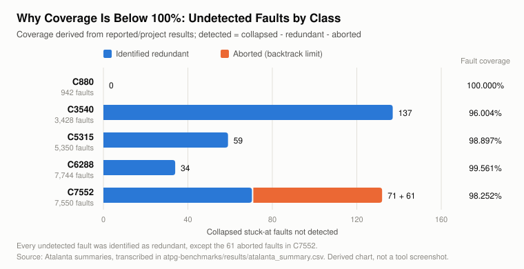

# Benchmark ATPG: ISCAS-85 with Atalanta

Stuck-at ATPG, fault coverage, redundant-fault analysis and test-pattern compaction on five ISCAS-85 combinational benchmarks (C880, C3540, C5315, C6288, C7552) with the **Atalanta** test generator.

| | |
|---|---|
| Design under test | ISCAS-85 `.bench` netlists (public; not committed, see [`benchmarks/`](benchmarks/README.md)) |
| Fault model | Single stuck-at, collapsed |
| Tool | Atalanta (Virginia Tech), mode `RPT + DTPG + TC`, backtrack limit 10 |
| Compaction | REVERSE + SHUFFLE (C7552 run with `-N`, i.e. none) |
| Evidence | Five Atalanta summary screenshots in [`results/screenshots/`](results/screenshots/), transcribed in [`results/atalanta_summary.csv`](results/atalanta_summary.csv) |
| Provenance | The original content of this repository, before consolidation |

The question asked of the data: *how do circuit complexity, fault coverage, pattern count, compaction and ATPG effort relate?*

## Results

All values are [R] reported by Atalanta except Reduction [D], derived. Source: [`atalanta_summary.csv`](results/atalanta_summary.csv), [`derived_metrics.csv`](results/derived_metrics.csv).

| Circuit | Gates | Collapsed faults | Fault coverage | Redundant | Aborted | Patterns before → after | Reduction [D] | Backtracks |
|---|---:|---:|---:|---:|---:|---|---:|---:|
| C880  |   383 |   942 | 100.000 % |   0 |  0 | 107 → 54 | 49.5 % |   0 |
| C3540 | 1,669 | 3,428 |  96.004 % | 137 |  0 | 253 → 153 | 39.5 % | 131 |
| C5315 | 2,307 | 5,350 |  98.897 % |  59 |  0 | 216 → 117 | 45.8 % |  66 |
| C6288 | 2,416 | 7,744 |  99.561 % |  34 |  0 | 52 → 27 | 48.1 % |  34 |
| C7552 | 3,512 | 7,550 |  98.252 % |  71 | 61 | 373, not compacted | n/a |  893 |

- In four of five circuits, every undetected fault was **proven redundant**. C3540's 96.004 % is a complete test of every testable fault.
- Only C7552 has unresolved (aborted) faults, at a backtrack limit of 10.
- Compaction removed 39.5–49.5 % of patterns (628 → 351 over the four compacted circuits, 44.1 %) with no loss of detected faults.
- Gate count predicts fault-list size (ρ = 0.90), but **not** pattern count, backtracks, CPU time or coverage.
- The source report's table lists C7552 as "216 → 117". That is C5315's row; the tool output shows compaction NONE and 373 patterns ([evidence-audit](../docs/evidence-audit.md#c7552-pattern-counts-in-the-observations-table)).



Full analysis: [`docs/benchmark-results.md`](../docs/benchmark-results.md) · compaction: [`docs/test-pattern-compaction.md`](../docs/test-pattern-compaction.md) · method: [`docs/atpg-methodology.md`](../docs/atpg-methodology.md#atalanta-benchmark-atpg).

## Run

```sh
# Analysis (Python 3 standard library; run from the repository root)
python3 atpg-benchmarks/scripts/derive_metrics.py   # verifies the transcription, writes results/*.csv
python3 atpg-benchmarks/scripts/make_charts.py      # data charts  -> ../assets/atalanta-*.svg
python3 atpg-benchmarks/scripts/make_diagrams.py    # diagrams     -> ../assets/atalanta-*.svg, stuck-at-and-gate.svg

# ATPG (needs Atalanta and the ISCAS-85 netlists)
atalanta -t c880.test iscas85/c880.bench
atalanta -N -t c7552.test iscas85/c7552.bench
```

All commands and options: [`atalanta-commands.md`](atalanta-commands.md). Re-run notes (seeds, C6288 provenance): [`docs/reproduction.md`](../docs/reproduction.md#2-benchmark-atpg-atalanta).

## Files

| File | Content |
|---|---|
| [`atalanta-commands.md`](atalanta-commands.md) | Atalanta / Fsim commands from the procedure, and which produced results |
| [`benchmarks/README.md`](benchmarks/README.md) | The five circuits and how to obtain the `.bench` files |
| [`scripts/derive_metrics.py`](scripts/derive_metrics.py) | Transcription check, derived metrics, rank correlations |
| [`scripts/make_charts.py`](scripts/make_charts.py), [`scripts/make_diagrams.py`](scripts/make_diagrams.py) | SVG figures |
| [`results/atalanta_summary.csv`](results/atalanta_summary.csv) | Transcribed summaries (one row per circuit) |
| [`results/derived_metrics.csv`](results/derived_metrics.csv), [`results/rank_correlation_vs_gates.csv`](results/rank_correlation_vs_gates.csv) | Generated |
| [`results/README.md`](results/README.md) | Column definitions |
| [`results/screenshots/`](results/screenshots/) | Five cropped Atalanta summaries |
