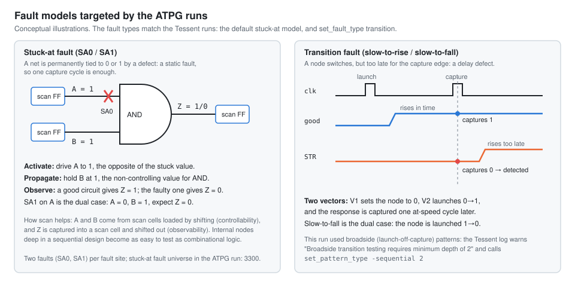
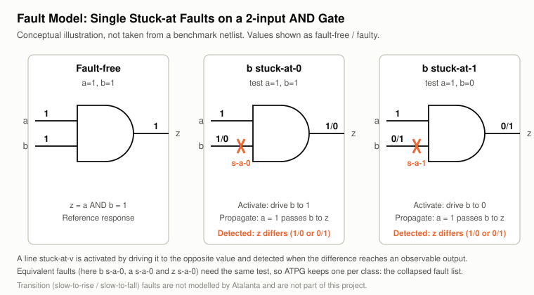
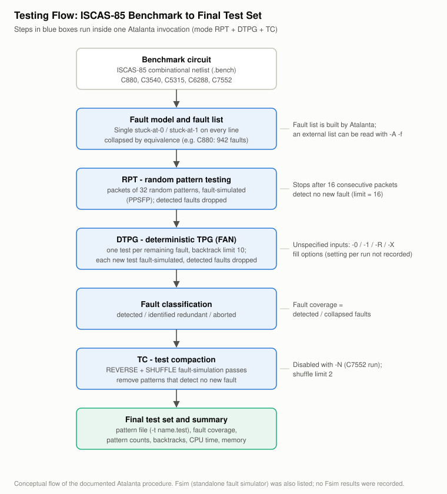
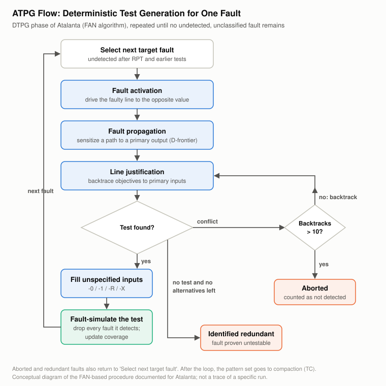
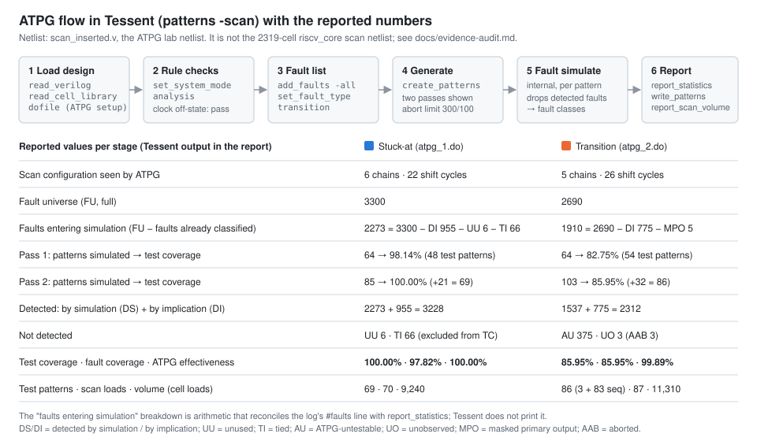

# ATPG Methodology and Fault Models

Two ATPG tools were used, on different designs and with different fault models:

| | Atalanta | Siemens Tessent (`patterns -scan`) |
|---|---|---|
| Module | [`atpg-benchmarks/`](../atpg-benchmarks/) | [`tessent-atpg/`](../tessent-atpg/) |
| Design | ISCAS-85 combinational benchmarks | Lab scan netlist `scan_inserted.v` (sequential, full scan) |
| Fault models | Single stuck-at | Stuck-at; transition (broadside) |
| Algorithm | Random patterns, then FAN | Random patterns, then deterministic ATPG (Tessent internal) |
| Compaction | REVERSE + SHUFFLE (static, explicit) | Tool default inside `create_patterns` (no explicit command) |
| Coverage metric | One "fault coverage" | Test coverage, fault coverage, ATPG effectiveness |

The two tools define coverage differently, so their numbers are never compared directly (see [Coverage metrics](#coverage-metrics)).

## Fault models



*Conceptual illustration.*

### Single stuck-at

One line (gate input, gate output or fanout branch) is permanently 0 (s-a-0) or 1 (s-a-1). To detect it, drive the line to the opposite value (**activation**) and set side inputs to non-controlling values so the difference reaches an observable point (**propagation**). The model is static, so one capture after loading the state is enough.



| Target fault on `z = a · b` | Test (a, b) | Good z | Faulty z |
|---|---|---:|---:|
| b s-a-0 | (1, 1) | 1 | 0 |
| b s-a-1 | (1, 0) | 0 | 1 |
| a s-a-1 | (0, 1) | 0 | 1 |
| z s-a-1 | (0, x) or (x, 0) | 0 | 1 |

**Fault collapsing.** Equivalent faults need identical tests (on an AND gate, a s-a-0, b s-a-0 and z s-a-0 are all detected only by (1, 1)), so ATPG keeps one representative per class. Atalanta's fault counts are **collapsed** counts (C880: 942). Tessent's `FU` is its full universe after its own fault-list rules (stuck-at run: 3,300).

### Transition (slow-to-rise / slow-to-fall)

A node switches, but too late for the capture edge. Detection needs two vectors: one to initialise the node and one to launch the transition, then a capture one functional cycle later. Tessent generated **broadside (launch-off-capture)** patterns. In the log, the tool raised the sequential depth itself:

```text
Current sequential depth:  0
Optimal sequential depth:  2
Warning: Broadside transition testing requires minimum depth of 2.
Calling: set_pattern_type -sequential 2
```

It also applied `set_transition_holdpi on` (primary inputs held between launch and capture) and `set_output_masks on` (primary outputs not observed). Both reduce what ATPG can test, which is why the transition run has 375 ATPG-untestable faults ([tessent-atpg.md](tessent-atpg.md)).

### Not modelled anywhere in this project

Path delay, bridging, IDDQ and cell-aware faults.

## Atalanta (benchmark ATPG)



Atalanta is a Virginia Tech test generator for single stuck-at faults in combinational circuits. All five summaries report mode `RPT + DTPG + TC`. Algorithm details come from the Atalanta documentation; the tool's source was not inspected.

| Phase | What it does | Setting in these runs |
|---|---|---|
| **RPT**: random pattern testing | Packets of 32 random patterns, fault-simulated in parallel (PPSFP). Detected faults are dropped, and useful patterns kept | Stops after 16 consecutive packets add nothing |
| **DTPG**: deterministic TPG | FAN on each remaining fault: activate, propagate (advance the D-frontier), justify (backtrace with unique sensitisation, headlines, multiple backtrace). Each new test is fault-simulated to drop other faults | Backtrack limit 10 |
| **TC**: test compaction | REVERSE + SHUFFLE static compaction ([test-pattern-compaction.md](test-pattern-compaction.md)) | Shuffle limit 2; disabled with `-N` for C7552 |



Each DTPG fault ends as **detected** (test found), **identified redundant** (search space exhausted, so no test exists) or **aborted** (backtrack limit reached, status unknown).

**Unspecified inputs.** FAN leaves don't-cares, which can be filled with `-0`, `-1`, `-R` (random) or left as X with `-X`. The fill used for the five recorded runs is not visible in the summaries. Commands: [`atpg-benchmarks/atalanta-commands.md`](../atpg-benchmarks/atalanta-commands.md).

## Tessent ATPG (scan netlist)



| Step | Command (from `atpg_1.do` / `atpg_2.do`) | Notes |
|---|---|---|
| Load | `set_context patterns -scan`, `read_verilog`, `read_cell_library`, `set_current_design` | Builds the design model |
| Test setup | `dofile scan_inserted.dofile`, `tessent_scan_setup` | Declares chains, clocks and the shift/capture procedure written by scan insertion |
| Rule checks | `set_system_mode analysis` | Logged: "All scan clocks successfully passed off-state check", capture clock `blif_clk_net`, 6 non-scan elements identified as transparent latches (TLA, rule D5) |
| Fault model | default stuck-at, or `set_fault_type transition` | |
| Fault list | `add_faults -all` | |
| Generate | `create_patterns` | Random patterns with fault simulation, then deterministic ATPG with fault dropping. Tool-chosen settings in the log: clock restriction `Domain_clock (edge interaction)`, abort limit raised from 30 to 300/100, sequential depth 0 (stuck-at) or 2 (transition) |
| Output | `write_patterns … -verilog -serial`, `… -verilog -parallel`, `… -ascii -parallel`, `report_scan_volume` | Serial testbench shifts every bit; parallel testbench force-loads scan cells; ASCII is tool-neutral |

No compression (EDT) command appears, although the report calls the tool "Tessent TestKompress". The runs are therefore treated as uncompressed scan ATPG.

## Coverage metrics

### Atalanta

Atalanta prints one figure, `Fault coverage`. Reconstructing it from the printed counts reproduces it to three decimals for all five circuits:

```text
fault coverage = detected / collapsed faults
detected       = collapsed − identified redundant − aborted
```

Redundant faults stay in the denominator, so a circuit with provably untestable logic cannot reach 100 %. Two derived figures are also used (Atalanta does not print them):

- **Coverage excluding redundant** = detected / (collapsed − redundant).
- **Fault efficiency** = (detected + redundant) / collapsed: the fraction of faults the ATPG resolved.

### Tessent

| Metric | Definition | Stuck-at (lab netlist) | Transition (lab netlist) |
|---|---|---:|---:|
| Test coverage (TC) | (DS + DI) / (FU − UU − TI − other structurally untestable). AU stays in the denominator | 3,228 / 3,228 = 100.00 % | 2,312 / 2,690 = 85.95 % |
| Fault coverage (FC) | (DS + DI) / FU | 3,228 / 3,300 = 97.82 % | 2,312 / 2,690 = 85.95 % |
| ATPG effectiveness (AE) | (FU − unresolved, e.g. aborted) / FU | 100.00 % | (2,690 − 3) / 2,690 = 99.89 % |

Fault classes: DS detected by simulation; DI detected by implication (for example scan-path faults exercised by the chain test); UU unused; TI tied; AU ATPG-untestable under the current constraints; UO unobserved; AAB aborted.

**Do not compare across tools.** Atalanta's "fault coverage" keeps redundant faults in the denominator. Tessent's "test coverage" removes structurally untestable classes but keeps AU. "Coverage excluding redundant" (Atalanta, derived) resembles Tessent TC but follows different class rules.

## References

- H. K. Lee and D. S. Ha, *On the generation of test patterns for combinational circuits*, Virginia Tech technical report 12_93, 1993: <https://vtechworks.lib.vt.edu/handle/10919/41915>
- Atalanta README (source mirror): <https://github.com/hsluoyz/Atalanta/blob/master/README>
- H. Fujiwara and T. Shimono, "On the acceleration of test generation algorithms," *IEEE Trans. Computers*, C-32(12), 1983 (FAN).
- Siemens Tessent command and rule definitions: Tessent Shell reference manuals (licensed documentation; not reproduced here).
