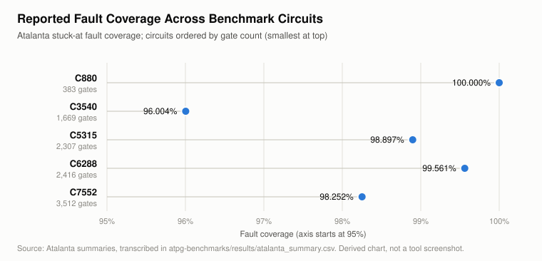
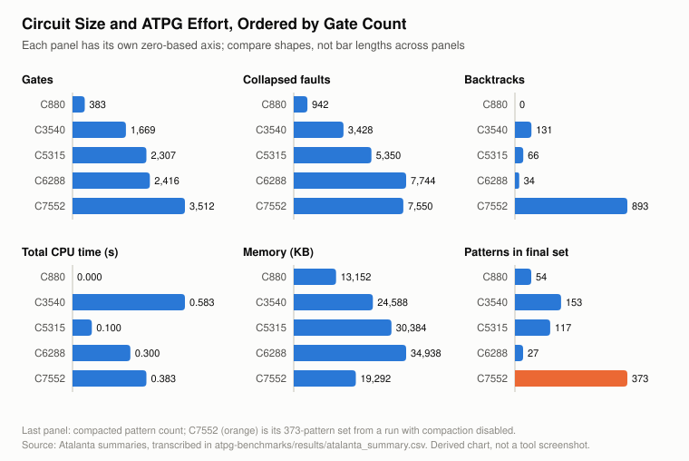

# ISCAS-85 Benchmark ATPG Results (Atalanta)

Module: [`atpg-benchmarks/`](../atpg-benchmarks/). Fault model: single stuck-at, collapsed. One Atalanta run per circuit, mode `RPT + DTPG + TC`.

Every number here is either:

- **[R] Reported**: printed in an Atalanta summary ([`screenshots/`](../atpg-benchmarks/results/screenshots/)), transcribed in [`atalanta_summary.csv`](../atpg-benchmarks/results/atalanta_summary.csv); or
- **[D] Derived**: computed by [`derive_metrics.py`](../atpg-benchmarks/scripts/derive_metrics.py) into [`derived_metrics.csv`](../atpg-benchmarks/results/derived_metrics.csv) and [`rank_correlation_vs_gates.csv`](../atpg-benchmarks/results/rank_correlation_vs_gates.csv).

Circuits are ordered by gate count.

## Benchmark circuits

| Circuit | PIs | POs | Gates | Levels | Collapsed faults | Faults per gate [D] | Function (ISCAS-85 literature) |
|---|---:|---:|---:|---:|---:|---:|---|
| C880  |  60 |  26 |   383 |  24 |   942 | 2.46 | 8-bit ALU |
| C3540 |  50 |  22 | 1,669 |  47 | 3,428 | 2.05 | 8-bit ALU with BCD arithmetic |
| C5315 | 178 | 123 | 2,307 |  49 | 5,350 | 2.32 | 9-bit ALU |
| C6288 |  32 |  32 | 2,416 | 124 | 7,744 | 3.21 | 16 × 16 array multiplier |
| C7552 | 207 | 108 | 3,512 |  43 | 7,550 | 2.15 | 32-bit adder / comparator |

Structural values are Atalanta's own [R] and may differ slightly from other published counts. The function column is background (Hansen, Yalcin & Hayes, 1999), not something this project measured.

## Run configuration [R]

| Parameter | C880 | C3540 | C5315 | C6288 | C7552 |
|---|---|---|---|---|---|
| Random-pattern limit (packets) | 16 | 16 | 16 | 16 | 16 |
| Backtrack limit | 10 | 10 | 10 | 10 | 10 |
| Compaction | REVERSE + SHUFFLE | REVERSE + SHUFFLE | REVERSE + SHUFFLE | REVERSE + SHUFFLE | **NONE** (`-N`) |
| Shuffle limit / shuffles run | 2 / 14 | 2 / 8 | 2 / 12 | 2 / 13 | — |
| Random seed | 1762600250 | 1762601580 | 1762601531 | 1761820498 | 1762600438 |

The command that produced the C6288 summary cannot be identified ([evidence-audit.md](evidence-audit.md#c6288-run-provenance)).

## Coverage

| Circuit | Collapsed [R] | Detected [D] | Redundant [R] | Aborted [R] | Fault coverage [R] | Coverage excl. redundant [D] | Fault efficiency [D] |
|---|---:|---:|---:|---:|---:|---:|---:|
| C880  |   942 |   942 |   0 |  0 | 100.000 % | 100.000 % | 100.000 % |
| C3540 | 3,428 | 3,291 | 137 |  0 |  96.004 % | 100.000 % | 100.000 % |
| C5315 | 5,350 | 5,291 |  59 |  0 |  98.897 % | 100.000 % | 100.000 % |
| C6288 | 7,744 | 7,710 |  34 |  0 |  99.561 % | 100.000 % | 100.000 % |
| C7552 | 7,550 | 7,418 |  71 | 61 |  98.252 % |  99.184 % |  99.192 % |

Detected = collapsed − redundant − aborted. Detected / collapsed reproduces the reported coverage to three decimals for all five circuits, and the script exits with an error if it ever does not. Definitions: [atpg-methodology.md](atpg-methodology.md#coverage-metrics).

### Redundant and aborted faults

- **Four of five circuits have zero aborted faults.** Every undetected fault in C880, C3540, C5315 and C6288 was proven redundant, so those test sets are complete for every testable fault.
- **C3540's 96.004 % is entirely redundancy:** 137 faults, 4.00 % of its list [D].
- **Redundancy does not follow size:** 0, 137, 59, 34, 71 by increasing gate count (ρ = 0.30).
- **C7552 is the one incomplete result:** its 61 aborted faults hit the backtrack limit of 10 and may be testable or redundant.

| Circuit | Redundant share of collapsed faults [D] |
|---|---:|
| C880  | 0.00 % |
| C3540 | 4.00 % |
| C5315 | 1.10 % |
| C6288 | 0.44 % |
| C7552 | 0.94 % |

## Patterns

| Circuit | Before compaction [R] | After compaction [R] | Reduction [D] |
|---|---:|---:|---:|
| C880  | 107 |  54 | 49.53 % |
| C3540 | 253 | 153 | 39.53 % |
| C5315 | 216 | 117 | 45.83 % |
| C6288 |  52 |  27 | 48.08 % |
| C7552 | 373 (uncompacted run) | — | not computed |

Compaction details: [test-pattern-compaction.md](test-pattern-compaction.md).

## ATPG effort [R]

| Circuit | Backtracks | Init (s) | Fault sim (s) | FAN (s) | Total CPU (s) | Memory (KB) |
|---|---:|---:|---:|---:|---:|---:|
| C880  |   0 | 0.000 | 0.000 | 0.000 | 0.000 | 13,152 |
| C3540 | 131 | 0.000 | 0.567 | 0.017 | 0.583 | 24,588 |
| C5315 |  66 | 0.000 | 0.083 | 0.017 | 0.100 | 30,384 |
| C6288 |  34 | 0.000 | 0.300 | 0.000 | 0.300 | 34,938 |
| C7552 | 893 | 0.000 | 0.050 | 0.333 | 0.383 | 19,292 |

Every reported time is a multiple of 1/60 s (about 16.7 ms) to within rounding, which suggests a clock-tick timer [D], so differences of one or two ticks are noise. C7552 is the only circuit where FAN time exceeds fault-simulation time, and it accounts for 893 of the 1,124 backtracks across all five runs. Host details were not recorded.

## Rank correlation with gate count

Spearman ρ [D], descriptive only. With n = 5 (or 4), none is statistically significant.

| Measure | Runs | ρ vs gates |
|---|---|---:|
| Collapsed faults | 5 | +0.90 |
| Backtracks | 5 | +0.60 |
| Logic levels | 5 | +0.40 |
| Total CPU time | 5 | +0.40 |
| Memory | 5 | +0.40 |
| Redundant faults | 5 | +0.30 |
| Fault coverage | 5 | −0.30 |
| Patterns before compaction | 4 compacted | −0.40 |
| Patterns after compaction | 4 compacted | −0.40 |
| Memory | 4 compacted | +1.00 |

## Interpretation

**Observed:**

1. Coverage is 96.0–100 %, and the gap is explained: in four circuits it is entirely proven-redundant faults; only C7552 has unresolved (aborted) faults.
2. Compaction removed 39.5–49.5 % of patterns with no loss of detected faults (guaranteed by construction).
3. Gate count predicts fault-list size (ρ = 0.90) and, for the compacted runs, memory. It does **not** predict pattern count, backtracks, CPU time, redundancy or coverage. C6288, the second-largest and deepest circuit (124 levels), needed the fewest patterns (52 → 27).
4. Coverage alone says little about tester cost: C6288 and C5315 have similar coverage, but C5315 needs over 4× as many patterns.

**General interpretation (not proven by five data points):** testability depends on structure (reconvergent fanout, redundancy, random-pattern resistance) more than on size. C6288 is a regular array multiplier, a structure generally regarded as highly random-pattern testable. Whether structure explains C3540's redundancy or C7552's aborts was not analysed. The report's claim of a "strong correlation" between complexity, coverage and pattern count is **not** supported by these runs ([evidence-audit.md](evidence-audit.md#discussion-text-on-redundancy-and-effort)).

## Limitations

- Five small combinational circuits, one run and one seed each, so run-to-run variance is unknown.
- Evidence is five summary screenshots. No `.test` files, fault lists or raw logs, so no pattern-level analysis (for example don't-care density) is possible.
- C7552 has no compacted result.
- The N-detect (`-D`), user fault list, manual-pattern Fsim and X/0/1-fill items of the assignment have no recorded results.

## References

- F. Brglez and H. Fujiwara, "A neutral netlist of 10 combinational benchmark circuits and a target translator in Fortran," *Proc. ISCAS*, 1985.
- M. C. Hansen, H. Yalcin and J. P. Hayes, "Unveiling the ISCAS-85 benchmarks: a case study in reverse engineering," *IEEE Design & Test*, 16(3), 1999.
