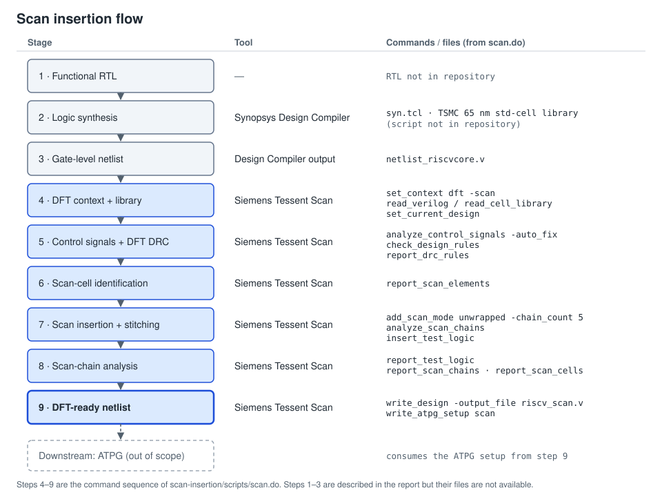
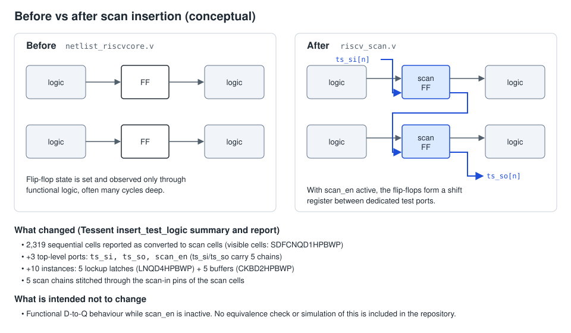
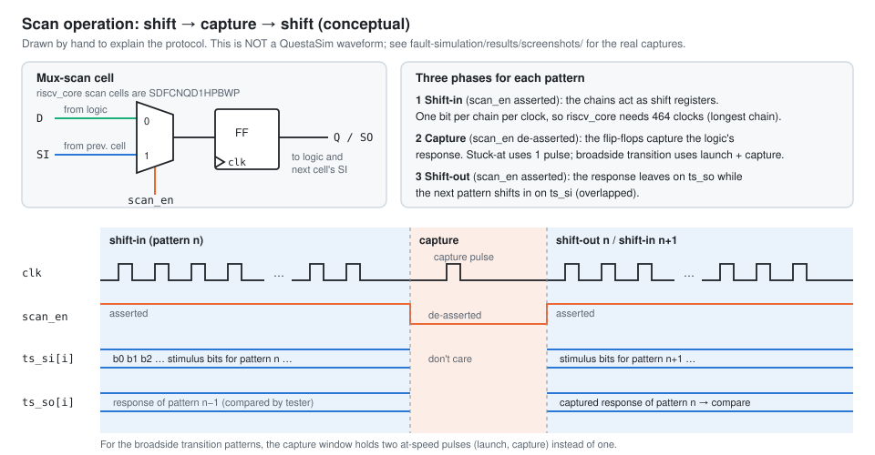

# Scan Insertion, Chain Stitching and Balancing

Module: [`scan-insertion/`](../scan-insertion/). Design under test: the `riscv_core` gate-level netlist (2,319 flip-flops). See [riscv-dft.md](riscv-dft.md) for what is known about the design itself.



## Why scan

After fabrication, a chip can only be tested through its pins. A test must **excite** a fault (drive the node to the opposite of its stuck value) and **propagate** its effect to something the tester can see. With 2,319 flip-flops, most of `riscv_core`'s state is reachable only through long, design-specific instruction sequences, so sequential ATPG over that state is impractical.

Scan design gives every flip-flop a second, multiplexed input (scan-in) and a mode signal (scan enable). In scan mode the flip-flops form shift registers between test ports:

| Property | Without scan | With scan (this design) |
|---|---|---|
| Controllability | Only via functional input sequences | Any 2,319-bit state can be shifted in, in 464 cycles |
| Observability | Only if an effect propagates to an output | Every captured flip-flop value is shifted out through `ts_so[4:0]` |

Each flip-flop becomes a pseudo-primary input and output, so the logic between flip-flops can be tested with combinational ATPG.

## Synthesis (report text only)

| Item | Value | Source |
|---|---|---|
| Tool | Synopsys Design Compiler | Text (p. 10) |
| Script | `syn.tcl` | Named in the text; contents not available |
| Technology | TSMC 65 nm standard cells, `tcbn65gplus` family, HPBWP variant | Text; library name in `scan.do`; cell suffixes in Tessent output |
| Output | `netlist_riscvcore.v` | `scan.do` |
| Sequential cells | 2,319 | Text; equals the sum of the chain lengths |
| Gates | 34,714 | Text only; counting basis unknown |

**Not known:** timing constraints, whether Design Compiler used a test-ready compile, and any area, timing or power report before or after scan. No overhead figure is therefore given anywhere.

## The Tessent Scan dofile

[`scan-insertion/scripts/scan.do`](../scan-insertion/scripts/scan.do) was transcribed from the editor screenshot on p. 17 ([`scan-do-script.png`](../scan-insertion/results/screenshots/scan-do-script.png)). The command lines are verbatim; the comments were added.

| # | Command(s) | What it does | Result in this project |
|---|---|---|---|
| 1 | `set_context dft -scan` | DFT context with scan insertion as the goal | — |
| 2 | `read_verilog netlist_riscvcore.v` | Load the Design Compiler netlist | — |
| 3 | `read_cell_library tcbn65gplushpbwp.mdt` | Tessent cell models: which cells are flip-flops and which scan equivalents exist | — |
| 4 | `set_current_design` | Elaborate the top module | Instance paths show `riscv_core` |
| 5 | `analyze_control_signals -auto_fix` | Trace clock, set and reset networks; add control where they are not pin-controllable | Text: 1 clock `/clk_i`, 1 reset `/rst_i` |
| 6 | `check_design_rules`, `report_drc_rules` | DFT design-rule checks | Text: FN1, FN4, S7 warnings (see below) |
| 7 | `report_scan_elements` | List scannable elements | Output not preserved |
| 8 | `add_scan_mode unwrapped -chain_count 5` | One internal-only scan mode with 5 chains | — |
| 9 | `analyze_scan_chains` | Allocate scan cells to chains | "populating 'unwrapped' chains: 100.0% completed (estimate)", a progress line, **not** a coverage figure |
| 10 | `insert_test_logic` | Swap in scan cells, stitch chains, add ports and lockup latches | 3 ports, 10 instances, 5 chains |
| 11 | `report_test_logic`, `report_scan_chains`, `report_scan_cells` | Reports | Transcribed in [`scan-insertion/results/`](../scan-insertion/results/) |
| 12 | `write_design -output_file riscv_scan.v -replace` | Scan-inserted netlist | Not preserved |
| 13 | `write_atpg_setup scan -replace` | ATPG dofile and test procedure | Not preserved, and not used by the recorded ATPG runs ([evidence-audit.md](evidence-audit.md#the-atpg-netlist-is-not-the-riscv_core-scan-netlist)) |

## DFT rule checks

DRC runs before the netlist is modified. It catches structures that break the scan model: uncontrollable clocks or asynchronous set/reset, floating or multiply-driven nets, constant-tied logic, and cells with no scan equivalent. A violation fixed here costs a netlist or constraint change. If it is missed, it shows up later as a shift failure, X-propagation in ATPG, or lost coverage.

| Rule (report wording) | Description (report) | Why it matters | Status |
|---|---|---|---|
| FN1 | Floating nets | Undriven nets simulate as X and can corrupt captured responses | Open; resolution not documented |
| FN4 | Non-controllable flip-flops | A flop whose clock or reset is not controllable may be excluded from scan or capture X | Open; resolution not documented |
| S7 | Constant-driven cells | Tied logic contains untestable faults (Tessent class TI) | Open; resolution not documented |
| Control signals | 1 clock (`/clk_i`), 1 reset (`/rst_i`), identified automatically | Defines the scan clock and the reset to hold off during shift | Handled by `-auto_fix` |
| Clock checks | All scan clocks passed off-state and stability checks | Scan clock can be held off and pulsed safely | Passed (text) |

The report calls the design "mostly DFT-clean" and also says the DRC was "successfully cleared" ([evidence-audit.md](evidence-audit.md#task-2-scan-insertion-on-riscv_core)). No DRC output is preserved, so violation counts and locations are unknown, and **the design is not described as DFT-clean here**. All 2,319 reported flip-flops ended up in chains, so whatever FN4 flagged did not stop those cells from being stitched.

## Insertion and stitching

`insert_test_logic` summary ([transcription](../scan-insertion/results/insert_test_logic_summary.txt), [screenshot](../scan-insertion/results/screenshots/tessent-test-logic-insertion.png)):

| Summary line | Value |
|---|---:|
| Added top-level port count | 3 (`ts_si`, `ts_so`, `scan_en`) |
| Added instance count | 10 |
| Added retiming logic count | 5 |
| Added scan chain count (unwrapped) | 5 |

The 10 added instances:

| Instance | Cell | Role |
|---|---|---|
| `riscv_core/u_mul/ts_lockup_latchn_clkc4_intno668_i` | `LNQD4HPBWP` | lockup latch |
| `riscv_core/u_div/ts_lockup_latchn_clkc0_intno750_i` | `LNQD4HPBWP` | lockup latch |
| `riscv_core/u_issue/u_pipe_ctrl/ts_lockup_latchn_clkc1_intno1024_i` | `LNQD4HPBWP` | lockup latch |
| `riscv_core/u_issue/u_regfile/ts_lockup_latchn_clkc2_intno1488_i` | `LNQD4HPBWP` | lockup latch |
| `riscv_core/u_issue/u_regfile/ts_lockup_latchn_clkc3_intno1952_i` | `LNQD4HPBWP` | lockup latch |
| `riscv_core/u_csr/tessent_persistent_cell_buf_extsi2319_i` | `CKBD2HPBWP` | buffer |
| `riscv_core/u_div/tessent_persistent_cell_buf_extsi2320_i` | `CKBD2HPBWP` | buffer |
| `riscv_core/u_issue/u_pipe_ctrl/tessent_persistent_cell_buf_extsi2321_i` | `CKBD2HPBWP` | buffer |
| `riscv_core/u_issue/u_regfile/tessent_persistent_cell_buf_extsi2322_i` | `CKBD2HPBWP` | buffer |
| `riscv_core/u_issue/u_regfile/tessent_persistent_cell_buf_extsi2323_i` | `CKBD2HPBWP` | buffer |

- **Scan-cell replacement.** The 2,319 replacements are not counted as added instances, which is consistent with replacement changing the cell type of existing instances. Every scan cell visible in `report_scan_cells` is an `SDFCNQD1HPBWP`. Under TSMC naming, that is a mux-scan D flip-flop with active-low clear and a Q output only, at drive strength 1. Only 18 cells are visible, so other variants cannot be ruled out.
- **Lockup latches.** "Added retiming logic count: 5" matches the five negative-level latches. A lockup latch on the shift path holds data for half a clock cycle, which adds hold margin where consecutive scan cells could race (for example across clock-tree branches). The evidence does not show why Tessent chose these five locations.
- **Buffers.** The evidence names the `extsi` buffers but not their function. Their naming suggests the scan-input side; this is not confirmed.
- **Stitching.** Each scan cell's `SI` connects to the previous cell's `Q` (the reported scan-out pin), chain ends connect to `ts_si[n]` / `ts_so[n]`, and every `SE` pin connects to `scan_en`.



## Scan chains


From `report_scan_chains` ([transcription](../scan-insertion/results/report_scan_chains.txt), [screenshot](../scan-insertion/results/screenshots/tessent-scan-chains-report.png)). All chains are in scan mode `unwrapped`, group `dummy`, clocked by `clk_i`:

| Chain | Scan in | Scan out | Length |
|---|---|---|---:|
| `chain0` | `/ts_si[0]` | `/ts_so[0]` | 464 |
| `chain1` | `/ts_si[1]` | `/ts_so[1]` | 464 |
| `chain2` | `/ts_si[2]` | `/ts_so[2]` | 464 |
| `chain3` | `/ts_si[3]` | `/ts_so[3]` | 464 |
| `chain4` | `/ts_si[4]` | `/ts_so[4]` | 463 |
| **Total** | | | **2,319** |

**Visible ordering.** The `report_scan_cells` screenshot shows 19 rows of `chain0` ([excerpt](../scan-insertion/results/report_scan_cells_excerpt.txt)):

| Position | Instance | Cell | Clock |
|---|---|---|---|
| — | `/u_div/ts_lockup_latchn_clkc0_intno750_i` | `LNQD4HPBWP` | `clk_i` (−) |
| 0–15 | `/u_div/dividend_q_reg[16]` … `[31]` | `SDFCNQD1HPBWP` | `clk_i` (+) |
| 16–17 | `/u_div/quotient_q_reg[30]`, `[29]` | `SDFCNQD1HPBWP` | `clk_i` (+) |

The latch has no cell number, so it is not counted in the chain length, which agrees with the lengths summing to exactly 2,319. In the visible rows, one block's registers sit together and buses appear in bit order, which keeps shift wiring local. The contents of chains 1–4 and the positions of the other four latches are not available.

## Balance


Output of `python3 scan-insertion/scripts/check_chain_balance.py`:

```text
Chains                       : 5
Total scan cells             : 2319
Longest / shortest chain     : 464 / 463
Spread (longest - shortest)  : 1
Mean chain length            : 463.8
Best possible integer split  : 464 max / 463 min
Optimally balanced           : yes
Shift cycles per load        : 464 (set by the longest chain)
Shift cycles, single chain   : 2319 (hypothetical, same cells in one chain)
Shift-cycle reduction        : 5.00x vs single chain
Idle shift slots per load    : 1 (cells' worth of padding on shorter chains)
```

- **Shift time is set by the longest chain.** All chains shift in parallel, so each load or unload takes `max(length)` = 464 cycles. Over a test set, shift cycles ≈ (patterns + 1) × longest chain, because each unload overlaps the next load.
- **This split is the arithmetic optimum.** 2,319 = 5 × 463 + 4, so four chains of 464 and one of 463 is the most even split possible. The 1-cell spread is a property of the cell count, not a tuning result.
- **Scale.** Five chains need 464 cycles per load against 2,319 for a single chain, about a 5× reduction. This is a calculated cycle count. No tester time or shift frequency was measured, and the report's claims of lower test power were not measured either.

## Shift and capture



*Conceptual diagram, not a simulated waveform.*

| Phase | `scan_en` | What happens |
|---|---|---|
| Shift in | asserted | Each `clk_i` pulse moves every chain one bit; one bit per chain enters at `ts_si[n]`; 464 pulses per load; `chain4` carries one padding bit |
| Capture | de-asserted | Flip-flops capture their combinational fan-in: one pulse for stuck-at, launch + capture for broadside transition |
| Shift out | asserted | The response leaves through `ts_so[n]` while the next pattern shifts in |

The polarity of `scan_en` is not visible in the evidence, so "asserted" and "de-asserted" are used. **No capture cycle was simulated or tested on `riscv_core`.** The test procedure written by `write_atpg_setup scan` is not preserved.

## Overhead

| | Before (`netlist_riscvcore.v`) | After (`riscv_scan.v`) |
|---|---|---|
| Sequential cells | 2,319 flip-flops (text) | 2,319 scan cells in 5 chains |
| Test ports | — | `ts_si[4:0]`, `ts_so[4:0]`, `scan_en` (+3 ports) |
| Extra instances | — | 5 lockup latches + 5 buffers |
| Functional behaviour | reference | intended to be identical with `scan_en` inactive; **not verified** by equivalence check or simulation |

Only the structural count is measured. **No area, timing or power comparison is available, so none is claimed.**

## Engineering tradeoffs

- **Full scan vs overhead.** Full scan gives maximum controllability and observability but puts a mux in every flip-flop's D path. Its area and timing cost was not measured.
- **Chain count vs pins.** Five chains need five scan-in/scan-out pairs for 464-cycle loads; ten would halve shift time but double the pins. The tester channel budget is not specified.
- **Balance vs routing.** Perfect balance can force chains to cross between blocks. The visible start of `chain0` keeps `u_div` registers together. No placement-aware reordering was done.
- **DFT logic vs function.** Scan logic must be invisible with `scan_en` inactive. Confirming this needs an equivalence check, which was not run.

## Limitations

- RTL, `syn.tcl`, both netlists and all raw logs are absent. Evidence is two Tessent screenshots, one editor screenshot and the report text.
- FN1, FN4 and S7 remain open with unknown counts.
- The gate count (34,714) and "100 % scan insertion" are text-only (the latter consistent with the chain total).
- No ATPG, coverage, pattern count or simulation exists for this netlist.
