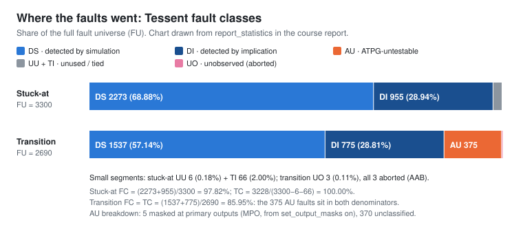

# Tessent ATPG: Stuck-at and Transition Results

Module: [`tessent-atpg/`](../tessent-atpg/).

> **Design under test:** the lab scan netlist `scan_inserted.v`, with about 130 scan cells and about 1,150 gates as seen by ATPG. It is **not** the 2,319-cell `riscv_core` scan netlist from [scan insertion](scan-insertion.md). See [evidence-audit.md](evidence-audit.md#the-atpg-netlist-is-not-the-riscv_core-scan-netlist). The two runs also used different scan configurations from each other.

Method and metric definitions: [atpg-methodology.md](atpg-methodology.md).

## Stuck-at run ([`atpg_1.do`](../tessent-atpg/scripts/atpg_1.do))

Transcription: [`stuck_at_atpg_excerpt.txt`](../tessent-atpg/results/stuck_at_atpg_excerpt.txt). Screenshots: [run](../tessent-atpg/results/screenshots/tessent-stuck-at-atpg-run.png), [statistics](../tessent-atpg/results/screenshots/tessent-stuck-at-statistics.png).

**Setup checks (Tool):** all scan clocks passed the off-state check; capture clock `blif_clk_net`; 6 non-scan memory elements identified as TLA (rule D5); `Simulation performed for #gates = 1158 #faults = 2273`.

**Progress (Tool):**

| Pass | Patterns simulated | Test coverage | Faults left | Detected (cum.) | Effective patterns | Test patterns |
|---|---:|---:|---:|---:|---:|---:|
| 1 | 64 | 98.14 % | 60 | 2,213 | 48 | 48 |
| 2 (deterministic) | 85 | 100.00 % | 0 | +60 | 21 | 69 |

**Statistics (Tool):**

| Class | Count | % of FU |
|---|---:|---:|
| FU (full universe) | 3,300 | 100 % |
| DS (detected by simulation) | 2,273 | 68.88 % |
| DI (detected by implication) | 955 | 28.94 % |
| UU (unused) | 6 | 0.18 % |
| TI (tied) | 66 | 2.00 % |
| **Test coverage** | | **100.00 %** |
| **Fault coverage** | | **97.82 %** |
| ATPG effectiveness | | 100.00 % |
| Test / simulated patterns | 69 / 85 | |
| CPU time | 3.8 s | |

The 2.18-point gap between TC and FC is exactly the 72 UU + TI faults. No pattern can detect them, so TC drops them and FC counts them. The tied faults are consistent with the S7 "constant-driven cells" type of DRC finding, although that finding was reported for `riscv_core`, not this netlist.

## Transition run ([`atpg_2.do`](../tessent-atpg/scripts/atpg_2.do))

Transcription: [`transition_atpg_excerpt.txt`](../tessent-atpg/results/transition_atpg_excerpt.txt). Screenshots: [run](../tessent-atpg/results/screenshots/tessent-transition-atpg-run.png), [statistics](../tessent-atpg/results/screenshots/tessent-transition-statistics.png), [fault classes](../tessent-atpg/results/screenshots/tessent-transition-fault-classes.png).

**Tool-applied settings:** `set_transition_holdpi on`, `set_output_masks on`, `set_abort_limit 300 100`, `set_pattern_type -sequential 2` (broadside). `Simulation performed for #gates = 1153 #faults = 1910`.

**Progress (Tool):**

| Pass | Patterns simulated | Test coverage | Faults left | Detected (cum.) | Effective patterns | Test patterns | RE/AU/AAB |
|---|---:|---:|---:|---:|---:|---:|---|
| 1 | 64 | 82.75 % | 206 | 1,451 | 54 | 54 | 0/258/3 |
| 2 | 103 | 85.95 % | 3 | +86 | 32 | 86 | 0/375/3 |

The log then warns: *"The number of AU faults has increased by 19.37% since the start of this ATPG run"* and *"Performing redundant fault identification for 8 faults"*. The result rows of that last step are not visible.

**Statistics (Tool):**

| Class | Count | % of FU |
|---|---:|---:|
| FU | 2,690 | 100 % |
| DS | 1,537 | 57.14 % |
| DI | 775 | 28.81 % |
| AU (ATPG-untestable) | 375 | 13.94 % |
| ↳ MPO (masked at primary output) | 5 | 0.19 % |
| ↳ unclassified | 370 | 13.75 % |
| UO (unobserved), all AAB (aborted) | 3 | 0.11 % |
| **Test coverage** | | **85.95 %** |
| **Fault coverage** | | **85.95 %** |
| ATPG effectiveness | | 99.89 % |
| Test patterns | 86 (3 basic + 83 clock-sequential) | |
| Simulated patterns | 103 | |
| CPU time | 4.3 s (4.4 s in a second printout) | |

**Why transition coverage is lower.** AU faults stay in the TC denominator, so TC equals FC here (there are no UU/TI faults). Unlike stuck-at, where the only undetected faults were structurally untestable, 375 faults could not be tested **under the chosen constraints**: depth-2 broadside, held primary inputs and masked outputs. The 5 MPO faults come directly from output masking. The other 370 are unclassified, and the source gives no root cause. High effectiveness (99.89 %) with low coverage means ATPG resolved almost every fault; raising coverage would need different constraints (for example launch-off-shift or unmasked outputs) or design changes, not a higher abort limit. This was not tried.

## Reconciliation by arithmetic (Derived)

| Check | Result |
|---|---|
| Stuck-at faults entering simulation | 3,300 − 955 (DI) − 6 (UU) − 66 (TI) = 2,273 = log `#faults` |
| Transition faults entering simulation | 2,690 − 775 (DI) − 5 (MPO) = 1,910 = log `#faults` |
| Stuck-at TC / FC | 3,228 / 3,228 = 100.00 %; 3,228 / 3,300 = 97.82 % |
| Transition TC = FC | 2,312 / 2,690 = 85.95 % |
| Transition AE | 2,687 / 2,690 = 99.89 % |
| Stuck-at volume | 70 × 6 × 22 = 9,240 |
| Transition volume | 87 × 5 × 26 = 11,310 |

## Scan volume (Tool)

| Run | Chains | Shift cycles | Pattern type | Test patterns | Scan loads | Volume (cell loads/unloads) |
|---|---:|---:|---|---:|---:|---:|
| Stuck-at | 6 | 22 | chain_test | 1 | 1 | 132 |
| | | | basic | 69 | 69 | 9,108 |
| | | | **total** | **70** | **70** | **9,240** |
| Transition | 5 | 26 | chain_test | 1 | 1 | 130 |
| | | | basic | 3 | 3 | 390 |
| | | | clock_sequential | 83 | 83 | 10,790 |
| | | | **total** | **87** | **87** | **11,310** |

Volume = scan loads × chains × shift cycles. The chain-test pattern shifts a known sequence through every chain before any logic test; it counts as a load but not as a logic test pattern.

## Charts

Both charts are drawn from the `report_statistics` values above; they are not tool screenshots.

## Pattern files

`serialpatterns.v`, `parallelpatterns.v` and `pattern.ascii` were written in each run (`LAB6/transition/…` for transition). None is preserved. Their simulation in QuestaSim is documented in [fault-simulation.md](fault-simulation.md).
