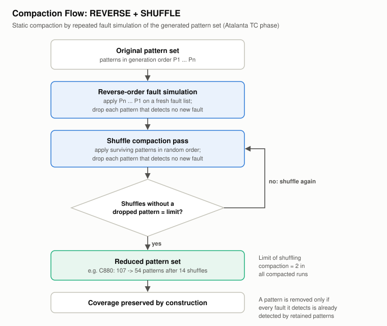

# Test-Pattern Compaction and Test Data Volume

Every pattern costs tester vector memory and test application time. This project has compaction evidence from two tools. The evidence is of very different quality, and the numbers are **not comparable** across the two (different designs, fault models and methods).

| | Atalanta (ISCAS-85) | Tessent (lab scan netlist) |
|---|---|---|
| Method | REVERSE + SHUFFLE static compaction, explicit (`TC` phase) | Tool-internal compaction inside `create_patterns`; no explicit command |
| Before/after counts | **Reported** for 4 circuits | **Not reported**; only final counts |
| Volume metric | Pattern count | Pattern count and scan volume (loads × chains × shift cycles) |

## Atalanta REVERSE + SHUFFLE

Atalanta's documented compaction runs **after** test generation, using repeated fault simulation:

1. **Reverse order.** Fault-simulate the set in reverse generation order on a fresh fault list, and drop any pattern that detects nothing new. Late deterministic patterns target hard faults and often also detect the easy faults that early random patterns were kept for, so those early patterns become removable.
2. **Shuffle.** Re-simulate the survivors in random orders and drop patterns the same way.
3. **Stop** after a set number of consecutive shuffles remove nothing. The summaries report a limit of 2, plus the shuffles actually run.

A pattern is dropped only if every fault it detects is already covered, so **the detected-fault set is preserved by construction**. Each summary prints only post-compaction coverage. `-N` disables compaction, which is how C7552 was run.

| Circuit | Before [R] | After [R] | Removed [D] | Reduction [D] | Shuffles [R] |
|---|---:|---:|---:|---:|---:|
| C880  | 107 |  54 |  53 | 49.53 % | 14 |
| C3540 | 253 | 153 | 100 | 39.53 % |  8 |
| C5315 | 216 | 117 |  99 | 45.83 % | 12 |
| C6288 |  52 |  27 |  25 | 48.08 % | 13 |
| **Four compacted circuits** | **628** | **351** | **277** | **44.11 %** | |
| C7552 | — | — | — | not compacted; 373 patterns | — |

Reduction = (before − after) / before, computed only where both counts are reported.

**Observations.** Reduction falls in a narrow 39.5–49.5 % band across circuits of very different size and structure. C3540 has the lowest reduction and the fewest shuffles, and still the largest compacted set. C7552's 373 is an uncompacted count and must not be compared with the others. The source report's table gives C7552 "216 → 117", which is a copy of C5315's row ([evidence-audit.md](evidence-audit.md#c7552-pattern-counts-in-the-observations-table)).

**Not known:** how much of the reduction came from the reverse pass versus shuffling, whether other seeds change the counts, and how fill options (`-0`, `-1`, `-R`, `-X`) would interact with compaction.

## Tessent (lab scan netlist)

`create_patterns` performs random-pattern simulation, then deterministic ATPG with fault dropping. Pattern merging and compaction are part of Tessent's default flow, but the logs show no explicit compaction setting and no before/after count, so **no compaction ratio can be stated**. What the logs do show is how the pattern set grew:

| Run | Pass 1 (test patterns → TC) | Pass 2 (test patterns → TC) | Final simulated patterns |
|---|---|---|---:|
| Stuck-at | 48 → 98.14 % | 69 → 100.00 % | 85 |
| Transition | 54 → 82.75 % | 86 → 85.95 % | 103 |

In the stuck-at run, the first 48 patterns reached 98.14 % test coverage, and 21 more closed the last 1.86 %: a long tail of tester time spent on few faults. In both runs fewer patterns were kept than simulated (69 of 85; 86 of 103). With the log's `# eff. patterns` column, this is consistent with non-effective patterns being discarded. That reading is an interpretation of the log columns; the tool does not state it.

No EDT compression was used, despite the report naming "TestKompress".

## Scan test data volume

For scan designs, compaction is only part of the cost. Each pattern also needs a full scan load.

| Design | Chains | Shift cycles / load | Loads | Volume (cell loads/unloads) | Source |
|---|---:|---:|---:|---:|---|
| Lab netlist, stuck-at | 6 | 22 | 70 | 9,240 | Tool |
| Lab netlist, transition | 5 | 26 | 87 | 11,310 | Tool |
| `riscv_core` | 5 | 464 | — (no ATPG) | — | Derived shift length only |

Volume = loads × chains × shift cycles. The `riscv_core` chains would need 464 shift cycles per load, about 18× the lab netlist's 26, and no pattern count exists to turn that into a volume. That gap is why EDT compression is the main future-work item for the RISC-V core ([riscv-dft.md](riscv-dft.md)).
