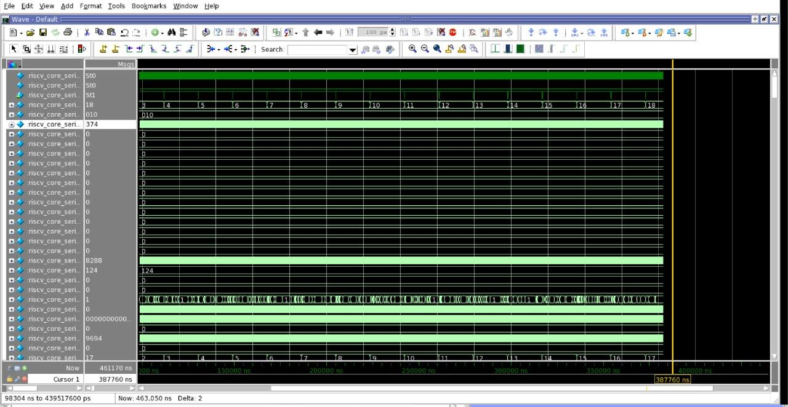

# Fault Simulation and Pattern Simulation

Evidence for the simulation side of the project. The source report uses "fault simulation" for three different things; this module keeps them apart.

| Simulator | Design | Produces coverage? | Where the result is |
|---|---|---|---|
| Atalanta built-in fault simulator (PPSFP) | ISCAS-85 benchmarks | Yes: Atalanta fault coverage | [`atpg-benchmarks/`](../atpg-benchmarks/) |
| Tessent internal fault simulation (`create_patterns`) | Lab scan netlist `scan_inserted.v` | Yes: TC / FC / AE | [`tessent-atpg/`](../tessent-atpg/) |
| **Siemens QuestaSim**: gate-level simulation of the Tessent pattern testbenches | Lab scan netlist `scan_inserted.v` | **No**: validates patterns against the fault-free circuit | **This module** |
| Fsim (standalone) | ISCAS-85 | — | **No output recorded** |

## QuestaSim evidence

| Patterns | Screenshot | Visible |
|---|---|---|
| Stuck-at | [`questasim-stuck-at-pattern-sim.png`](results/screenshots/questasim-stuck-at-pattern-sim.png) | Wave window, signals truncated to `riscv_core_seri…`, counters stepping 3 … 18, `Now` 461,170 ns |
| Transition | [`questasim-transition-pattern-sim.png`](results/screenshots/questasim-transition-pattern-sim.png) | Same structure, counters stepping 1 … 11, `-No Data-` at the cursor |

## Status: completion not evidenced

- The report says "Completed 50% of the fault simulation process", "analyzed partial results" and "Fault Simulation was completed successfully".
- No transcript, mismatch count, pass message or coverage figure exists.
- **This repository does not claim that the pattern simulation completed or passed.** No QuestaSim coverage number exists, and none is reported.

No QuestaSim scripts or commands survive, so this module has no `scripts/` folder. A generic command sequence is in [`docs/reproduction.md`](../docs/reproduction.md#questasim-pattern-simulation).

Full write-up: [`docs/fault-simulation.md`](../docs/fault-simulation.md). Provenance: [`riscv-dft-atpg`](https://github.com/Tanisha110705/riscv-dft-atpg) (`assets/evidence/`).
