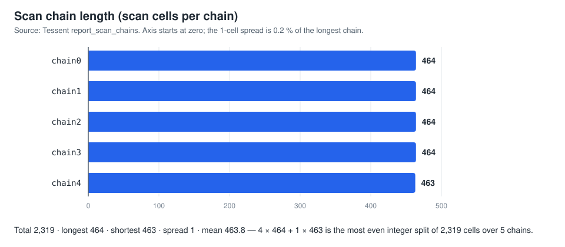

# Scan Insertion: riscv_core

Scan-cell insertion, chain stitching, DFT rule checks and chain balancing on the gate-level netlist of a RISC-V core (`riscv_core`, TSMC 65 nm), using **Siemens Tessent Scan**.

| | |
|---|---|
| Design under test | `riscv_core` gate-level netlist `netlist_riscvcore.v` (Design Compiler, TSMC 65 nm) |
| Tool | Siemens Tessent Shell, `dft -scan` context |
| Script | [`scripts/scan.do`](scripts/scan.do), transcribed from the original |
| Evidence | Tessent terminal screenshots and their transcriptions in [`results/`](results/); report text |
| Out of scope | ATPG. No ATPG was run on this netlist (see [`docs/riscv-dft.md`](../docs/riscv-dft.md)) |
| Provenance | Merged from [`scan-insertion-tessent`](https://github.com/Tanisha110705/scan-insertion-tessent) and the scan part of [`riscv-dft-atpg`](https://github.com/Tanisha110705/riscv-dft-atpg) |

## Flow

```text
netlist_riscvcore.v + tcbn65gplushpbwp.mdt
  → analyze_control_signals -auto_fix      clk_i, rst_i identified
  → check_design_rules / report_drc_rules   FN1, FN4, S7 warnings (open)
  → add_scan_mode unwrapped -chain_count 5
  → analyze_scan_chains → insert_test_logic
  → report_test_logic / report_scan_chains / report_scan_cells
  → write_design riscv_scan.v ; write_atpg_setup scan
```

## Results

| Metric | Value | Evidence | Source file |
|---|---:|---|---|
| Scan chains | 5 | Tool | [`report_scan_chains.txt`](results/report_scan_chains.txt) |
| Chain lengths | 464 / 464 / 464 / 464 / 463 | Tool | [`report_scan_chains.txt`](results/report_scan_chains.txt) |
| Scan cells in chains | 2,319 | Derived | `check_chain_balance.py` |
| Spread (longest − shortest) | 1 cell, the arithmetic optimum | Derived | `check_chain_balance.py` |
| Shift cycles per load | 464 (vs 2,319 for a single chain) | Derived | `check_chain_balance.py` |
| Added ports | 3: `ts_si[4:0]`, `ts_so[4:0]`, `scan_en` | Tool | [`insert_test_logic_summary.txt`](results/insert_test_logic_summary.txt) |
| Added instances | 10: 5 lockup latches `LNQD4HPBWP` + 5 buffers `CKBD2HPBWP` | Tool | [`insert_test_logic_summary.txt`](results/insert_test_logic_summary.txt) |
| Added retiming logic | 5 | Tool | [`insert_test_logic_summary.txt`](results/insert_test_logic_summary.txt) |
| Scan cell (visible rows) | `SDFCNQD1HPBWP`, `clk_i` rising edge | Tool | [`report_scan_cells_excerpt.txt`](results/report_scan_cells_excerpt.txt) |
| Flip-flops | 2,319 (consistent with chain total) | Text | report p. 12 |
| Scan insertion | 100 % of reported flip-flops (consistent, not proven) | Text | report p. 13 |
| Gates | 34,714 | Text only | report p. 12 |
| Control signals | 1 clock `/clk_i`, 1 reset `/rst_i` | Text | report p. 11 |
| DRC | FN1, FN4, S7 warnings; counts unknown; **not** DFT-clean | Text | report pp. 11–12 |

Not measured, so not claimed: area, timing or power overhead; shift power; tester time; functional equivalence after insertion.



## Run

Chain statistics (no EDA tools needed):

```sh
python3 scan-insertion/scripts/check_chain_balance.py            # uses results/report_scan_chains.txt
python3 scan-insertion/scripts/check_chain_balance.py my_run.txt # any report_scan_chains listing
```

The Tessent flow needs Tessent, the TSMC 65 nm Tessent library and `netlist_riscvcore.v`, none of which is included. See [`docs/reproduction.md`](../docs/reproduction.md#scan-insertion-riscv_core).

## Files

| File | Content |
|---|---|
| [`scripts/scan.do`](scripts/scan.do) | Tessent dofile (command lines verbatim, comments added) |
| [`scripts/check_chain_balance.py`](scripts/check_chain_balance.py) | Chain statistics |
| [`results/report_scan_chains.txt`](results/report_scan_chains.txt) | Transcribed `report_scan_chains` |
| [`results/insert_test_logic_summary.txt`](results/insert_test_logic_summary.txt) | Transcribed `insert_test_logic` + `report_test_logic` |
| [`results/report_scan_cells_excerpt.txt`](results/report_scan_cells_excerpt.txt) | First 19 rows (1 latch + 18 scan cells) of `chain0` |
| [`results/screenshots/`](results/screenshots/) | `tessent-test-logic-insertion.png`, `tessent-scan-chains-report.png`, `scan-do-script.png` |

Full write-up: [`docs/scan-insertion.md`](../docs/scan-insertion.md). Discrepancies (chain count 4 vs 5 vs 6, input netlist name, DRC status): [`docs/evidence-audit.md`](../docs/evidence-audit.md#task-2-scan-insertion-on-riscv_core).
