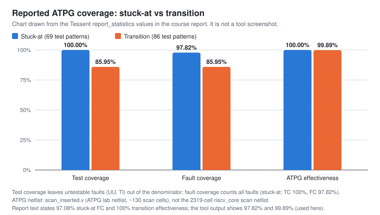

# Tessent ATPG: Stuck-at and Transition

Stuck-at and broadside transition ATPG with **Siemens Tessent** (`patterns -scan`) on a scan-inserted lab netlist, with coverage statistics and scan volume.

> **Design under test: the lab scan netlist `scan_inserted.v`, not `riscv_core`.** The ATPG logs report 6 chains × 22 shift cycles (stuck-at) and 5 × 26 (transition), about 1,150 gates and capture clock `blif_clk_net`. The 2,319-cell `riscv_core` scan netlist has 5 × 464 chains. These results are **not** coverage for the RISC-V core. Evidence: [`docs/evidence-audit.md`](../docs/evidence-audit.md#the-atpg-netlist-is-not-the-riscv_core-scan-netlist).

| | |
|---|---|
| Tool | Siemens Tessent Shell, `patterns -scan` context (named "Tessent TestKompress" in the report; no compression commands used) |
| Scripts | [`scripts/atpg_1.do`](scripts/atpg_1.do) (stuck-at), [`scripts/atpg_2.do`](scripts/atpg_2.do) (transition), original file names, transcribed |
| Evidence | Tessent screenshots and transcriptions in [`results/`](results/) |
| Provenance | From [`riscv-dft-atpg`](https://github.com/Tanisha110705/riscv-dft-atpg) |

## Results (all Tool values from `report_statistics` / `report_scan_volume`)

| Metric | Stuck-at | Transition | Source file |
|---|---:|---:|---|
| Netlist read | `scan_inserted.v` | `LAB4/scan_inserted.v` | scripts |
| Scan chains / shift cycles | 6 / 22 | 5 / 26 | excerpts |
| Gates / faults in simulation | 1,158 / 2,273 | 1,153 / 1,910 | excerpts |
| Fault universe (FU) | 3,300 | 2,690 | excerpts |
| Detected DS + DI | 2,273 + 955 | 1,537 + 775 | excerpts |
| Not detected | UU 6, TI 66 | AU 375 (MPO 5, unclassified 370), UO/AAB 3 | excerpts |
| **Test coverage** | **100.00 %** | **85.95 %** | excerpts |
| **Fault coverage** | **97.82 %** | **85.95 %** | excerpts |
| ATPG effectiveness | 100.00 % | 99.89 % | excerpts |
| Test patterns | 69 | 86 (3 basic + 83 clock-sequential) | excerpts |
| Simulated patterns | 85 | 103 | excerpts |
| Scan loads / volume | 70 / 9,240 | 87 / 11,310 | excerpts |
| CPU time | 3.8 s | 4.3 s (4.4 s in a second printout) | excerpts |
| Pattern type | combinational (depth 0) | broadside, `-sequential 2`, held PIs, masked POs | excerpts |

Where the report's prose differs (stuck-at FC "97.08 %", transition "83 patterns", "1910 faults", "100 %" effectiveness, "11,318" loads), the tool output is used ([details](../docs/evidence-audit.md#report-text-vs-tool-output)).



## Run

Requires Tessent, the TSMC 65 nm Tessent library and the lab netlist plus its dofile, none of which is included:

```sh
tessent -shell -dofile atpg_1.do -log atpg_sa.log    # typical invocation, not recorded in the report
tessent -shell -dofile atpg_2.do -log atpg_tr.log    # needs LAB4/ inputs and an existing LAB6/transition/
```

## Files

| File | Content |
|---|---|
| [`scripts/atpg_1.do`](scripts/atpg_1.do) | Stuck-at ATPG dofile |
| [`scripts/atpg_2.do`](scripts/atpg_2.do) | Transition ATPG dofile |
| [`results/stuck_at_atpg_excerpt.txt`](results/stuck_at_atpg_excerpt.txt) | Transcribed stuck-at log, statistics, scan volume |
| [`results/transition_atpg_excerpt.txt`](results/transition_atpg_excerpt.txt) | Transcribed transition log, statistics, fault sub-classes, scan volume |
| [`results/screenshots/`](results/screenshots/) | 5 cropped Tessent screenshots |

Full write-up: [`docs/tessent-atpg.md`](../docs/tessent-atpg.md). Method: [`docs/atpg-methodology.md`](../docs/atpg-methodology.md).
